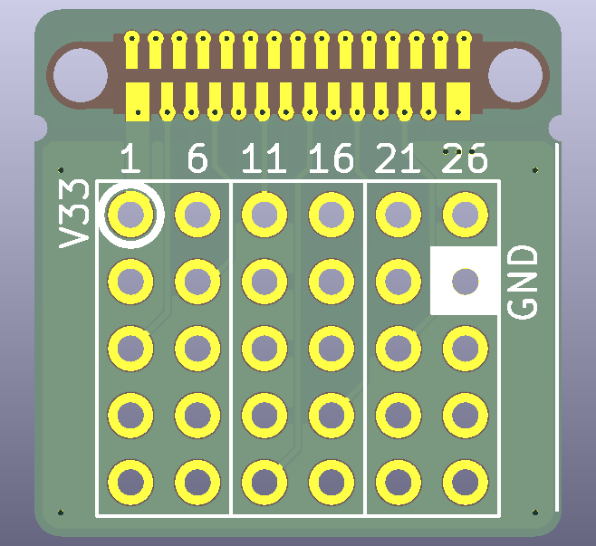
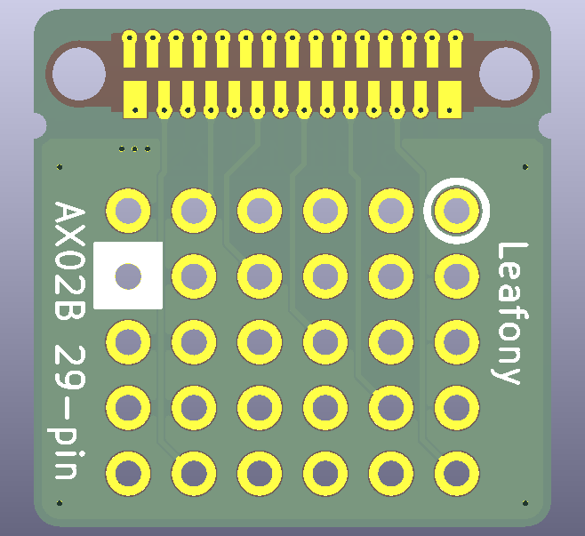

# AX02B 29-pin Leaf

AX02B 29-pin Leafは、Leafony Busの29ピンを2.54mmピッチのスルーホールパッドへ引き出す変換リーフです。ブレッドボード、ユニバーサル基板、ジャンパワイヤ、ピンヘッダを使った試作や信号確認に利用できます。

## 外観

| Top | Bottom |
| --- | --- |
|  |  |

## 特徴

- Leafony Busの29ピンを2.54mmピッチのスルーホールパッドに変換
- Leafony規格の20mm角リーフ形状

## ピン配置

表面シルクの番号は、左上から下方向に5ピンずつ進む配置です。

| 列 | ピン |
| --- | --- |
| 1 | 1, 2, 3, 4, 5 |
| 2 | 6, 7, 8, 9, 10 |
| 3 | 11, 12, 13, 14, 15 |
| 4 | 16, 17, 18, 19, 20 |
| 5 | 21, 22, 23, 24, 25 |
| 6 | 26, 27, 28, 29 |

KiCad回路図上ではLeafony Busの `F1` から `F29` を各スルーホールパッドへ接続しています。

## ファイル構成

```text
.
├── docs/
│   ├── top.png
│   └── bottom.png
└── kicad/ax02-29-pin/
    ├── ax02-29-pin.kicad_pro
    ├── ax02-29-pin.kicad_sch
    ├── ax02-29-pin.kicad_pcb
    └── panelized/
```

## 製造データ

面付け済みデータは `kicad/ax02-29-pin/panelized/Gerber/` にあります。
